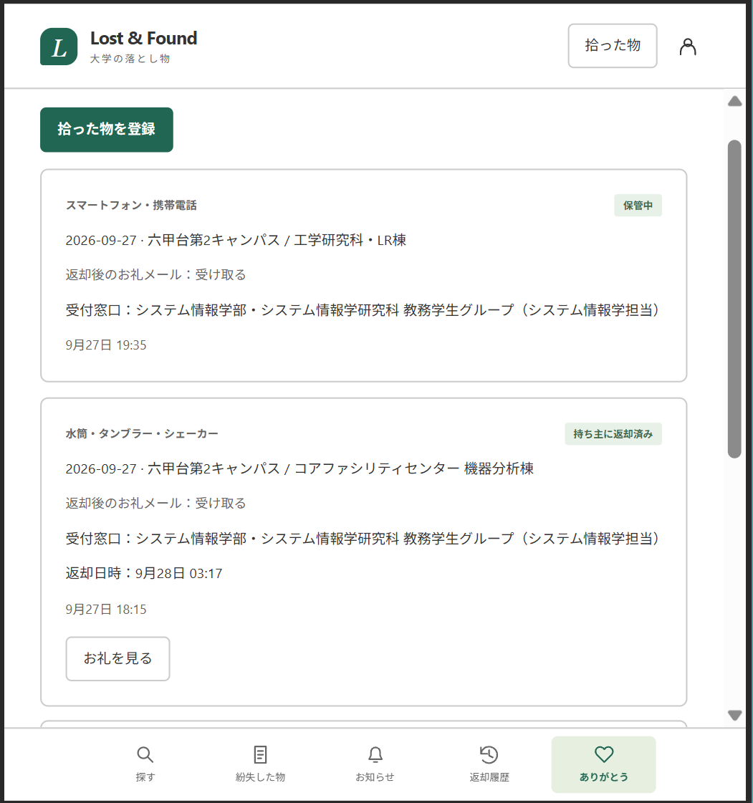

# 返却までの操作フロー

## 拾得物の登録

### 職員が登録する場合

- 拾った人：登録せず、そのまま現物を窓口に届けてもよい。
- 職員：「保管中の拾得物」→「拾得物を登録」→ 内容を入力。
- お礼メールを希望する人だけ学籍番号を入力。不要なら空欄。
- 職員：学生一覧に公開するか判断 →「登録」。
- 公開品は学生が検索できる。非公開品は職員が紛失申告と照合する。

動画：

<video controls width="100%">
  <source src="./video/拾得物登録-職員.mp4" type="video/mp4">
  この環境では動画を再生できません。
</video>

<!-- ここに動画リンク・埋め込みを追加 -->

### 学生が窓口に届けてから登録する場合（任意）

- 学生：現物を窓口に届ける → ログイン →「拾った物」→ 登録。メールは自動記録。
- 種類・色・キャンパスを選択 → 建物・エリアを検索して選択（任意）→ 詳細場所を入力（任意）。
- 「持ち主に返却されたら、お礼メールを受け取る」は初めからチェックあり。不要なら外す。
- 職員：「保管中の拾得物」→「学生の届け出」→「内容を確認」。
- 職員：現物確認・公開判断 →「受領して登録」。保管中の一覧に入る。
- 受付できない場合は理由を記録。まだ現物が来ていなければ確認待ちのまま。

動画：

<video controls width="100%">
  <source src="./video/拾得物登録-学生.mp4" type="video/mp4">
  この環境では動画を再生できません。
</video>

<!-- ここに動画リンク・埋め込みを追加 -->

## 返却までのケース

学生は申し込みがあるケースを「紛失した物」で確認する。

`探し中 → 候補あり → 受け取り予定 → 受け取り済み`

一覧で見つけた場合は「受け取り予定」から始まる。申し込み後の本人確認・返却は共通。
「候補あり」は「候補を見る（○件）」を開いて確認する。複数候補も申告の下にまとめて表示。

### ケース：学生が一覧から自分の物を見つけた

- 学生：「探す」→ 絞り込み → 品物の詳細 →「自分のものだと思う」。
- 学生：特徴を任意入力 →「受け取りを申し込む」→ 窓口へ。
- 申し込み時に「紛失した物」を自動登録 →「受け取り予定」。追加の入力は不要。
- 職員の本人確認・返却は「窓口での返却」と共通。

動画：

<video controls width="100%">
  <source src="./video/自分のものを見つけた.mp4" type="video/mp4">
  この環境では動画を再生できません。
</video>

<!-- ここに動画リンク・埋め込みを追加 -->

### ケース：紛失申告の後、公開品の通知が届いた

- 学生：検索して見つからない →「紛失した物を登録」→「探し中」。
- 職員が条件に合う公開品を登録 → 学生にメール・アプリ内通知。
- 学生：「お知らせ」→「候補の詳細を見る」→ 受け取りを申し込む → 窓口へ。
- 通知が届くと「候補あり」、申し込むと「受け取り予定」になる。
- 「紛失した物」→「候補を見る（○件）」からも、各候補の詳細を確認して申し込める。
- 一覧から申し込む場合と同じく、「紛失した物」で確認できる。職員の本人確認・返却も共通。

動画：

- 検索して見つからない →「紛失した物を登録」→「探し中」

<video controls width="100%">
  <source src="./video/紛失届.mp4" type="video/mp4">
  この環境では動画を再生できません。
</video>

- 職員が条件に合う公開品が登録される →「お知らせ」→「候補の詳細を見る」→ 受け取りを申し込む → 窓口へ。

<video controls width="100%">
  <source src="./video/お知らせから受け取り申し込み.mp4" type="video/mp4">
  この環境では動画を再生できません。
</video>

<!-- ここに動画リンク・埋め込みを追加 -->

### ケース：職員が非公開品を見つけて案内した

- 職員：「学生の紛失申告」→ 申告を選ぶ → 非公開の保管品を選ぶ。
- 職員：現物と申告内容を確認 →「この品物で本人へ案内」。
- 学生：通知の受取窓口を確認 →「受け取りを申し込む」→ 窓口へ。
- 品物の詳細は通知に出さない。案内が届くと「候補あり」、申し込むと「受け取り予定」になる。
- 「紛失した物」の候補欄では、品物の詳細を伏せた窓口の案内から申し込める。

動画：

- 職員が、「学生の紛失申告」→ 申告を選ぶ → 非公開の保管品を選ぶ。

<video controls width="100%">
  <source src="./video/貴重品を見つけて案内.mp4" type="video/mp4">
  この環境では動画を再生できません。
</video>

- 学生が、通知の受取窓口を確認 →「受け取りを申し込む」→ 窓口へ。

<video controls width="100%">
  <source src="./video/通知を見て受け取り申し込み.mp4" type="video/mp4">
  この環境では動画を再生できません。
</video>

<!-- ここに動画リンク・埋め込みを追加 -->

### ケース：申告・申し込みなしで窓口に来た

どちらも既存機能で対応できる。以下の2パターンから運用を決める。

#### 案1：その場で申し込んでから返却

- 公開品：学生が「探す」→ 品物を選ぶ → 特徴を任意入力 →「受け取りを申し込む」。
- 非公開品：学生が「紛失した物を登録」→ 職員が申告と現物を照合して案内 → 学生が通知から「受け取りを申し込む」。
- 申し込むと「受け取り予定」。職員は下の「申し込みがある場合の本人確認・返却」で対応する。

<!-- ここに動画リンク・埋め込みを追加 -->

#### 案2：申し込みなしで返却

- 職員：「受取対応」→「申出なしで返却」→ 該当する拾得物を選ぶ。
- 職員：「本人確認・返却」→ 返却先の学籍番号を入力 → 本人確認。
- 職員：「返却を完了する」。その場で紛失申告を作る必要はない。

動画：

<video controls width="100%">
  <source src="./video/申し込みなしで返却.mp4" type="video/mp4">
  この環境では動画を再生できません。
</video>

<!-- ここに動画リンク・埋め込みを追加 -->

## 窓口での返却

### 申し込みがある場合の本人確認・返却（各ケース共通）

- 職員：「受取対応」→ 学籍番号などで検索 →「本人確認・返却」。
- 職員：現物・申告した特徴・本人を確認 → 確認にチェック →「返却を完了する」。
- 拾得物を「返却済み」にし、学生の画面では「受け取り済み」になる。
- 同じ品物へのほかの申し込みは終了。その人たちの紛失登録は残り、探索を続けられる。

動画：

<video controls width="100%">
  <source src="./video/返却.mp4" type="video/mp4">
  この環境では動画を再生できません。
</video>

<!-- ここに動画リンク・埋め込みを追加 -->

## 返却後のお礼

### 拾った人へありがとうを伝える

- 職員が返却を完了 → お礼を希望した拾得者の学校メールへ固定のお礼。
- 文面：「届けてくださった落とし物は、持ち主に返却できました。ご協力ありがとうございました。」
- 学生が登録した届け出は「ありがとう」タブに履歴が残る。返却記録が反映されると「持ち主に返却済み」と返却日時を表示する。
- 受信チェックなし・メール未登録なら送らない。
- 拾得者・持ち主のメールアドレスは互いに公開しない。

画像：

<!-- ここに動画リンク・埋め込みを追加 -->

## 取り下げ・返却記録の訂正

- 学生：「申し込みを取り消す」→「受け取り予定」から「候補あり」に戻る。候補がなければ「探し中」。
- 学生：「取り下げ」→ 登録全体を終了。受け取り申し込みも一緒に取り消す。
- 職員：「返却履歴」→ 詳細 →「その他の操作」→ 理由・現物確認 →「理由を残して返却を取り消す」。
- 返却取消は、現物が窓口にある場合に行う。送信済みメールは取り消せない。

<!-- ここに動画リンク・埋め込みを追加 -->
