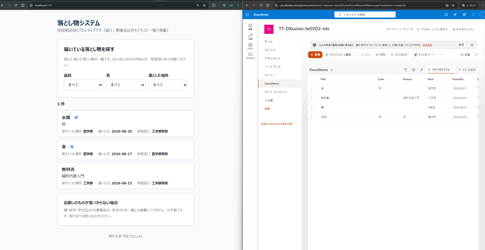
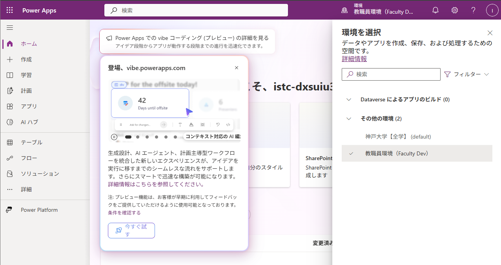
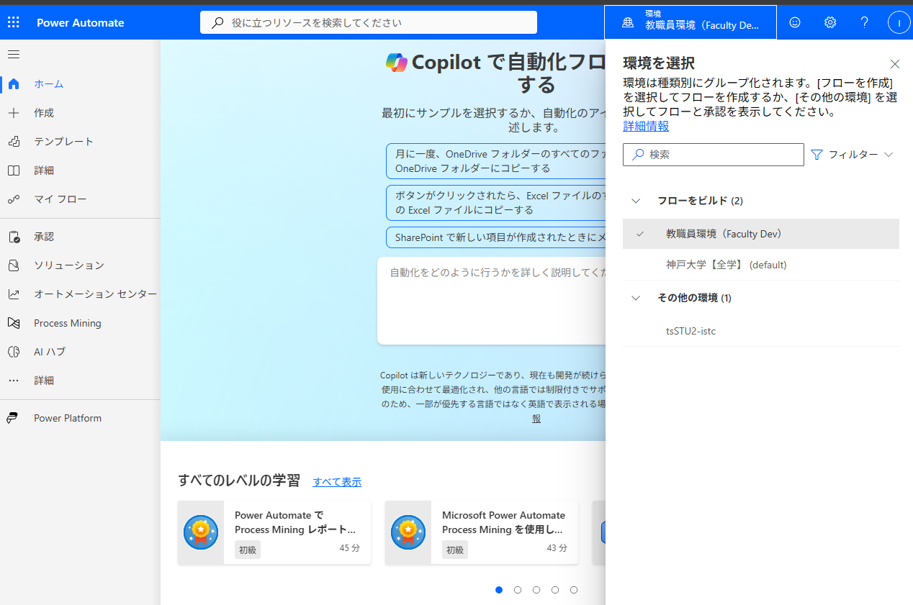
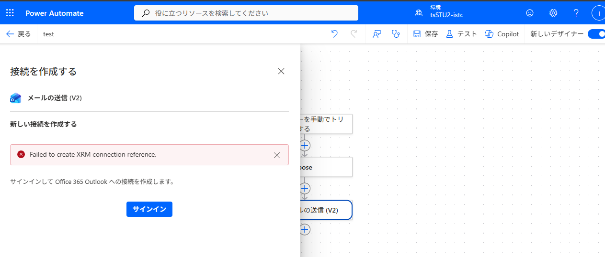
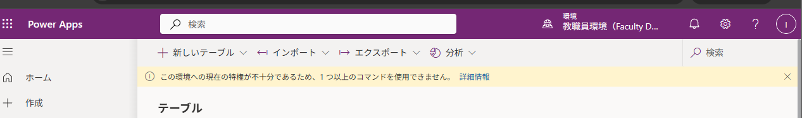

# 落とし物検証

# 動作を確認できたこと



指定環境では権限が不足しているため、**教職員環境（Faculty Dev）で検証**した。

## ・案Dの代表シナリオが動作した

**職員が SharePoint に登録した拾得物が、学生向けWebアプリの一覧に表示されることを確認した。**

```
職員：SharePoint リスト（FoundItems）に登録
        ↓
Power Automate：HTTP要求の受信時 → 複数の項目の取得 → 応答
        ↓
学生：Vite + React の一覧画面に表示
```

| 確認できたこと                                        | 結果                                         |
| ----------------------------------------------------- | -------------------------------------------- |
| SharePoint リストの作成                               | **できた**                             |
| 職員による登録（SharePoint の標準画面をそのまま利用） | **できた**（専用アプリは作っていない） |
| フローによる一覧の取得                                | **できた**                             |
| Webアプリでの一覧表示・絞り込み                       | **できた**                             |

## ・（補足）Power Automate から大学メールへ自動送信できた

外部から POST した内容が大学のメールアドレスへ自動送信されること、送信した値がメール本文に正しく反映されることを確認済み。

---

# 止まったところ

## ・Power Appsに指定環境(**tsSTU2-istc**)が表示されない



power Automateでは指定環境(tsSTU2-istc)表示され選択できるが、その他の環境 (1)に入っている



指定環境のPower Automateで接続を使わないフローは作成・保存・有効化できたが、接続を使うコネクタの接続が失敗した

## ・Power Automateで指定環境(**tsSTU2-istc**)でコネクタの接続が作れない

Power Automateのフロー作成でOffice 365 Outlook の接続を作ろうとすると、以下のerror

```
Failed to create XRM connection reference.
```

`XRM` は Dataverse の旧称。接続の情報を Dataverse のレコードとして保存しようとして、書き込み権限が無く失敗していると読める



**この環境では SharePoint も Outlook も接続が1つも作れないため、指定環境での検証が進められない状態。**

なお、接続の作成には「環境作成者（Environment Maker）」の権限が必要とされている。当該環境が Power Apps の環境一覧に表示されないこと（表示には環境作成者などの権限が必要）とあわせて、**この権限が付与されていないと考えられる**。

参考までに、同じアカウントでも**教職員環境では Outlook の接続を作成でき、フローも動作した**。環境ごとに割り当てが異なると思われる。

## ・Dataverse のテーブルが作れない

テーブル作成しようとすると「この環境への現在の特権が不十分であるため、1つ以上のコマンドを使用できません。」

と表示され、テーブルが作成できない。



## ・Azureポータル（Microsoft Entra ID）にアクセスできない

`portal.azure.com` へ検証用アカウントでサインインすると、以下が表示される。

```
現時点ではこれにはアクセスできません
サインインは完了しましたが、このリソースへのアクセス条件を満たしていません。
たとえば、管理者によって制限されているブラウザー、アプリ、または場所から
アクセスしている可能性があります。
```

**検証用アカウントから Azure Portal を開けず、Entra ID のアプリ登録の作成可否も確認できていない。**

Entra ID のアプリ登録は、**学生向け Web アプリに「大学 Microsoft アカウントでログインする機能」を実装するため**に必要。

### 確認事項

1. **検証用アカウントから Entra ID の管理画面へアクセスする方法があるか**
2. **このプロジェクト用のアプリ登録を、検証用アカウントで作成・管理してよいか**
   - 可能な場合、アプリ登録の作成・設定変更に必要な `Application Developer` ロールを付与できるか。
   - 組織管理者の同意が必要なアクセス権限がある場合は、その承認のみ大学側で別途必要。

# 付与ほしい権限

指定環境（**tsSTU2-istc**）に対して、以下を**追加で**付与がほしい（現在の権限は残したまま）。

1. **環境作成者（Environment Maker）**

   **接続（コネクタ）の作成に必要。** これが無いと SharePoint や Outlook をフローに接続できず、検証そのものが進まないため必須。

   現在この権限が無いと判断した根拠は次のとおり。Power Apps で環境一覧に表示されるには「システム管理者・システムカスタマイザー・環境作成者・その環境内のアプリの所有者」のいずれかが必要だが、**当該環境は Power Apps の一覧に表示されない**ため。
2. **システム カスタマイザー（System Customizer）**

   Dataverse のテーブル作成に必要。

   データを保存する場所としては、SharePointより業務システムとして運用する際に必要となるデータの整合性・アクセス制御・変更履歴の管理は、Dataverse のほうがシステム側で確実に行えるため、本番構成の候補として比較対象としている。
3. **基本ユーザー（Basic User）**

   既に付与されている可能性が高いが、念のため。

### 現在の割当状況

- エラーメッセージでは `roleCount=1` と表示されており、割り当て済みのセキュリティロールは1つ確認できている。
- 割り当て済みのロール名は未確認。現在のロールと、不足しているロールの確認が必要。
- 複数のセキュリティロールは権限が累積されるため、既存ロールを削除せず、不足するロールのみ追加する。

---

# **ライセンスについて**

ライセンスがあっても必要な権限がなければ作成・設定できない。反対に、権限があっても必要なライセンスがなければ、対象の有料機能を正式運用できない。

## 1.「HTTP要求の受信時」トリガーについて

学生向けWebアプリから拾得物の一覧を取得するために、このトリガーを現在使用している。**Power Automate の画面上でプレミアムのダイヤモンド表示を確認済み**。また、**教職員環境で実際に動作することも確認済み**。ただし、実際に使用する指定環境（**tsSTU2-istc**）で、このトリガーを使うフローを正式に継続利用できるライセンスがあるかは未確認。

**(1) 指定環境で利用できるライセンスがあるか**

教職員環境で動作したことだけでは、指定環境（**tsSTU2-istc**）で正式に利用できるとは判断できない。本学の契約内容と、指定環境で作成するフローに適用できるライセンスの有無を確認したい。

**(2) 誰にライセンスが必要か**

学生向けWebアプリからフローを呼び出す構成の場合、プレミアムライセンスが必要なのは、

- **フローの所有者（1名）のみ**か
- **呼び出す学生全員**か

## 2. Dataverse について

Dataverseを使える場合についても。

- 本学に Power Apps / Power Automate のプレミアムライセンスの契約はあり、検証用アカウント（istc-dxsuiu37 / istc-dxsuiu36）に割り当て可能か
- 本番運用時、ライセンスが必要になるのは誰か（利用する学生の人数に応じて増えるのか、環境やフロー単位で済むのか）
