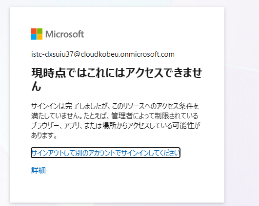

# 1. 動作確認できたこと

## 1.1 学生向けWebアプリとSharePointの接続

検証環境（tsSTU2-istc）では、次の構成が動作した。

```text
学生
  ↑
React＋Viteの一覧画面にリストを表示
  ↑
Power Automate：HTTP要求の受信時 → 複数の項目の取得 → 応答
  ↑
SharePoint：リスト（FoundItems）
```

## 1.2 Power AppsとSharePointの接続

検証環境（tsSTU2-istc）では、Power AppsからSharePointの`FoundItems`リストへ直接接続し、SharePointに登録されている拾得物をPower Appsの一覧画面に表示できることを確認した。

```text
職員
  ↓
Power Apps：拾得物の一覧を表示
  ↓
SharePoint：リスト（FoundItems）
```

これにより、職員向け画面はPower Apps、データの保存先はSharePointとする構成が技術的に接続できることを確認した。

### 動作確認動画

[apps.powerapps.com/play/e/4673518f-05bc-e242-9104-50370b6e23b6/a/312cf735-b6d6-404e-8938-c39dbed804cb?tenantId=20ee4c80-87bd-422c-a506-3a2b0aca0615&amp;hint=230c3147-c336-406e-83a8-ec7418282c47&amp;sourcetime=1787505204561](https://apps.powerapps.com/play/e/4673518f-05bc-e242-9104-50370b6e23b6/a/312cf735-b6d6-404e-8938-c39dbed804cb?tenantId=20ee4c80-87bd-422c-a506-3a2b0aca0615&hint=230c3147-c336-406e-83a8-ec7418282c47&sourcetime=1787505204561)

<video controls width="100%">
  <source src="./レコーディング 2026-08-24 003442.mp4" type="video/mp4">
  この環境では動画を再生できません。
</video>

## 1.3 Entra ID管理画面へのアクセス状況

検証用アカウントで、次のEntra ID管理画面へアクセスを試したが、現在もアクセスできない。

- [Microsoft Entra管理センター](https://entra.microsoft.com/)



今回追加された「環境作成者」と「システムカスタマイザー」は、Power Platform環境内でアプリやフロー、Dataverse等を扱うための権限である。Entra ID管理画面へのアクセスやアプリ登録を行う権限とは別のため、これらの追加後もEntra IDへのアクセス状況は変わっていない。

学生向け画面の大学アカウント認証や、独自APIからMicrosoft Graphを経由してSharePointへ接続する検証には、大学側でのEntra IDアプリ登録またはEntra ID側の権限設定が別途必要になる。

# 2. 学生向け画面（React）からSharePointの拾得物情報を取得する方法

## 2.1 Power Automateを経由して取得する

現在のHTTPトリガーはプレミアム機能であり、指定環境で使用可能なProcessライセンスはない。Processライセンスは、1ライセンス当たり**年間約27万円（税別）**かかることが分かった。

ライセンスがないにもかかわらず動作している理由は未確認だが、ライセンス違反を検出してから停止するまでの猶予期間や、ライセンス判定の反映遅延等が考えられる。

[Microsoft公式のPower Automate価格ページ
](https://www.microsoft.com/ja-jp/power-platform/products/power-automate/pricing#tabs-pill-bar-ocd242_tab0)

## 2.2 独自APIとMicrosoft Graphを経由して取得する

年間約27万円かかるPower Automate Process方式以外では、独自APIからMicrosoft Graphへ接続し、SharePointから情報を取得する方式が考えられる。

Microsoft Graphの通常のSharePointリスト操作には追加のAPI料金はかからないが、独自APIのコードを書く必要がある。

また、学生向けアプリの利用者認証とは別に、SharePointへ接続するためのEntra IDアプリ登録が必要になる。

# 3. データの保存先

Dataverseではなく、保存先の第一候補をSharePointとする。

理由は次のとおり。

- 職員がPower AppsからDataverseへ直接接続する構成では、原則として、利用する職員ごとにPower Apps Premium等のDataverse利用権が必要になり、金額が膨大に。
- ProcessライセンスではDataverse接続の利用権を利用者ではなくフローに持たせられるが、職員・学生の全操作をそのフロー経由にする必要があり、SharePoint案よりフロー数と保守範囲が増える。

そのため、現時点ではDataverseの利点よりライセンスと構成の負担が大きいと判断する。
